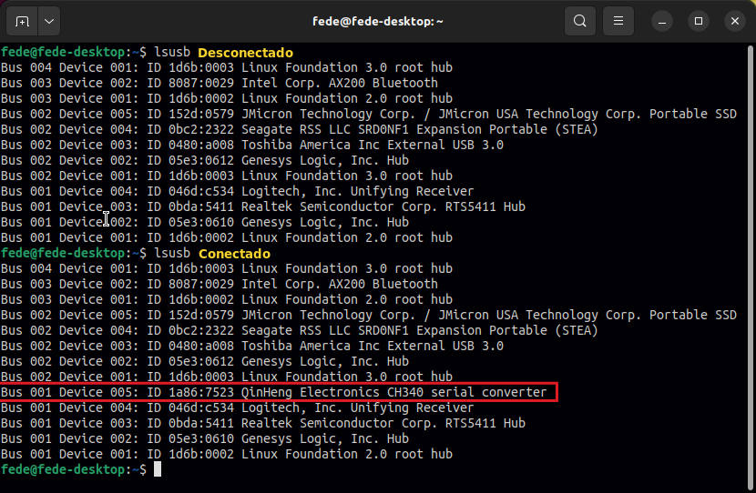
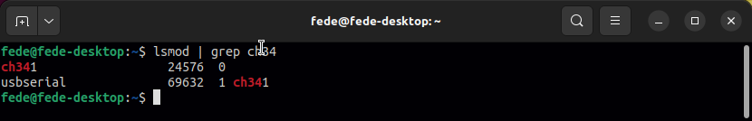
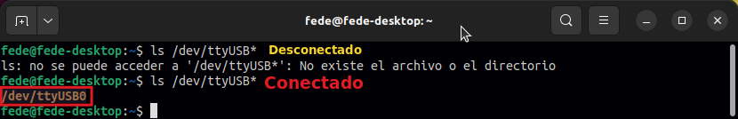

Para comprobar si el chip CH340 está siendo reconocido y si su controlador está cargado en Ubuntu, no necesitas instalar software adicional, ya que la mayoría de las versiones de Linux (como Ubuntu 20.04 y superiores) incluyen el soporte de forma nativa en el núcleo.

## <FONT COLOR=#007575>**Verificar si el sistema detecta el hardware**</font>
Conecta tu dispositivo y ejecuta el comando ```lsusb```. Este comando enumera los dispositivos USB conectados.

<center>

  

</center>

La línea destacada indica que Ubuntu reconoce el hardware.

## <FONT COLOR=#007575>**Verificar si el controlador está cargado**</font>
Para saber si el driver específico del núcleo está activo, usa ```lsmod``` para listar los módulos cargados:

<center>

  

</center>

Si el controlador está funcionando, verás una salida que menciona el módulo ch34x o ch341.

## <FONT COLOR=#007575>**Comprobar la creación del puerto serie**</font>
Si el driver está instalado correctamente, se debería crear un archivo de dispositivo en ```/dev/```. Compruébalo con:

<center>

  

</center>

Deberías ver algo como ```/dev/ttyUSB0```. Si este archivo aparece, el driver está instalado y operativo.

## <FONT COLOR=#007575>**Problemas comunes**</font>
Si el hardware se detecta (```lsusb```) pero no aparece el puerto (```/dev/ttyUSB0```), considera lo siguiente:

* **Conflicto con BRLTTY**: En Ubuntu 22.04 y versiones recientes, el servicio de lectura braille ```brltty``` a veces entra en conflicto con el chip CH340 y bloquea el puerto. Puedes desactivarlo temporalmente para probar:

``` sh
# Para detener el servicio se usa
sudo systemctl stop brltty-udev.service
# Al usar 'mask' en conjunto con 'stop' 
# se desabilita de forma permanente el servicio
sudo systemctl mask brltty-udev.service
```

* **Permisos de usuario**: Si el puerto aparece pero no puedes acceder a él desde el IDE de Arduino, añade tu usuario al grupo ```dialout```:

```powershell
sudo usermod -a -G dialout $USER
```

Es necesario cerrar sesión y volver a entrar para que el cambio de grupo surta efecto
